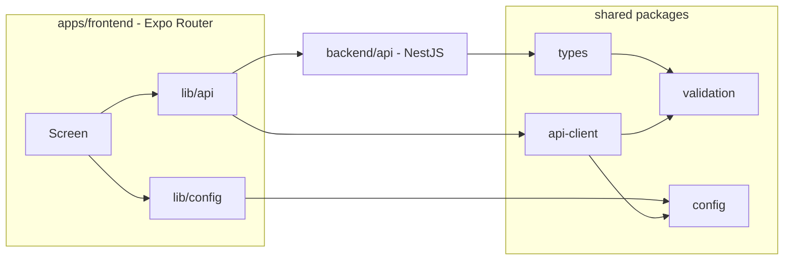

# HELPZY

**Find the Right Service, Right Around You.**

HELPZY is a local-services marketplace. This repository is the complete
monorepo for it: one Expo codebase that serves web, Android and iOS, a NestJS
API, and the shared packages both sides compile against.

The project is delivered in phases. **PHASE 1 - Foundation and PHASE 2 - Database
are complete**; see [`docs/phase-01-foundation.md`](docs/phase-01-foundation.md)
and [`docs/phase-02-database.md`](docs/phase-02-database.md) for the delivered
scope, and [`docs/roadmap.md`](docs/roadmap.md) for what comes next.

## Requirements

| Tool       | Version  | Notes                                         |
| ---------- | -------- | --------------------------------------------- |
| Node.js    | >= 20.19 | Node 24 LTS is what this repo is verified on. |
| pnpm       | 11.x     | Enforced through the `packageManager` field.  |
| PostgreSQL | 15+      | Verified on 18.6. Required to run the API.    |

Docker is **not** required. On Windows, install Node and pnpm, then clone.

## Getting started

```bash
pnpm install          # installs every workspace and builds the shared packages
cp .env.example .env # create your local environment file (Windows: copy)
```

### Database

The API needs a PostgreSQL database. Create the role and database once:

```bash
psql -U postgres -c "CREATE ROLE helpzy LOGIN PASSWORD 'helpzy_dev_password' CREATEDB;" \
                 -c "CREATE DATABASE helpzy OWNER helpzy;"
```

Then:

```bash
pnpm --filter @helpzy/api run db:migrate   # apply the schema
pnpm --filter @helpzy/api run db:seed      # development fixtures, safe to re-run
```

`GET /health` reports `process: UP` and `database: UP` once this is done. See
[`docs/phase-02-database.md`](docs/phase-02-database.md) for the schema, the
migration and the seed accounts.

On Windows, stop the API before running `db:generate`: Windows will not let
Prisma replace its loaded query-engine DLL.

### Run it

```bash
pnpm dev          # API on http://localhost:4000 + Expo dev server
pnpm dev:api      # API only
pnpm dev:web      # Expo web (http://localhost:8081)
pnpm dev:android  # Expo on a connected Android device / emulator
pnpm dev:ios      # Expo on an iOS simulator (macOS only)
```

Then open the app and tap **Check API again** on the foundation screen: the card
turns green only when the frontend has really reached the backend through the
shared client.

The canonical development frontend origin is `http://localhost:8081` (the Expo
web dev server). `http://127.0.0.1:8081`, `http://localhost:19006` (Expo Go),
`http://127.0.0.1:19006` and `http://localhost:3000` / `http://127.0.0.1:3000`
(static export preview) are also allowed, all of them from `API_CORS_ORIGINS`.
The API refuses a wildcard because it is credentialed - add a port there rather
than switching the allow-list off.

### Verify it

```bash
pnpm verify         # format:check + lint + typecheck + unit + e2e tests
pnpm smoke          # live contract check; requires `pnpm dev:api` running
pnpm build          # shared packages, then the API, then the web bundle
pnpm --filter @helpzy/frontend run doctor   # expo-doctor (21 checks)
```

## Repository layout

```
apps/frontend      Expo Router app - web, Android and iOS from one codebase
backend/api        NestJS API (CommonJS, Jest)
packages/types     Shared domain and transport types
packages/validation Zod schemas shared by the API and the client
packages/api-client Typed fetch client used by the app
packages/config    Brand, environment resolution and shared route paths
docs/              Architecture, code standards, testing, roadmap
scripts/           Repository-level verification helpers
```

## How the pieces fit together



- **One source of truth for configuration.** `app.config.ts` loads the root
  `.env` and passes public values to the app through Expo `extra`, so web,
  Android and iOS read the same values.
- **One source of truth for the API contract.** `packages/validation` validates
  payloads on both sides; `packages/types` types every envelope.
- **Operational routes are not versioned.** `GET /health` stays at the root so
  uptime probes and load balancers keep working when product routes move to
  `/api/v1`.
- **One database client.** Prisma owns the schema and migrations; the API talks
  to it only through `PrismaService`, which is the only place a connection is
  opened or closed.
- **Health is a contract, not a debug endpoint.** Each dependency is a named
  check with its own latency, so a probe failure says _what_ is down, not just
  that something is.
- **One error format, one origin list.** Every failure - including a route that
  does not exist - returns `{ error: { code, message, requestId, timestamp } }`.
  Every allowed browser origin is an explicit entry in `API_CORS_ORIGINS`.
- **Security headers in one place.** Helmet runs inside `configureApp`, so the
  dev server, the tests and production all serve the same headers.

## Environment

`.env` lives at the repository root and is read by both the API (NestJS
`ConfigModule`) and the Expo app. `.env.example` documents every variable; the
values that must be renamed per developer are marked there. Never commit a real
`.env` - it is git-ignored.

## Documentation

| Document                                                   | Purpose                                        |
| ---------------------------------------------------------- | ---------------------------------------------- |
| [docs/README.md](docs/README.md)                           | Index of the documents below                   |
| [docs/architecture.md](docs/architecture.md)               | Monorepo layout, request lifecycle, data layer |
| [docs/code-standards.md](docs/code-standards.md)           | Naming, error handling, API and UI conventions |
| [docs/testing.md](docs/testing.md)                         | What is tested today and how to add to it      |
| [docs/roadmap.md](docs/roadmap.md)                         | Phases 1-8 and their exit criteria             |
| [docs/phase-01-foundation.md](docs/phase-01-foundation.md) | PHASE 1 status report                          |
| [docs/phase-02-database.md](docs/phase-02-database.md)     | PHASE 2 status report                          |
| [docs/screenshots/](docs/screenshots)                      | Captured proof of the running app              |
