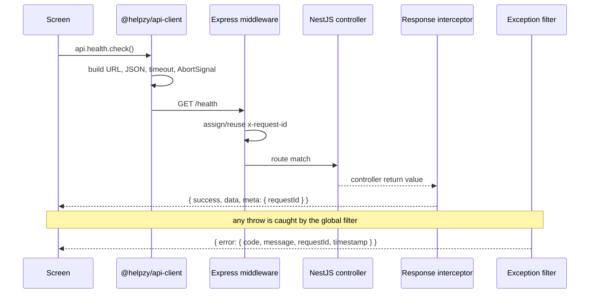
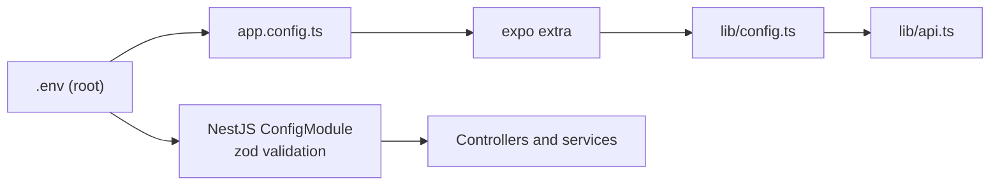
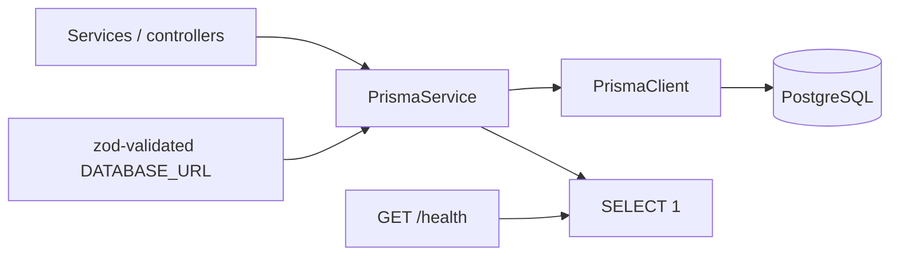

# HELPZY - Architecture

## 1. Principles

1. **One codebase per surface.** The frontend is a single Expo Router app that
   builds for web, Android and iOS. There is no separate web app, and no
   hand-maintained `android/` or `ios/` directory.
2. **Shared contracts, not shared code paths.** `packages/*` hold types, schemas,
   routes and the API client. Business logic lives in the app or the API, never
   in a package that both import.
3. **The API contract is the boundary.** Every request crosses
   `packages/api-client`; every payload is validated by `packages/validation`.
4. **Configuration is resolved once.** One root `.env`, read by the NestJS
   config module and by `app.config.ts`, and passed to the app through Expo
   `extra`.
5. **Fail loudly during development, quietly for users.** Errors carry a request
   id and a safe message; stack traces and internal detail never leave the
   process.

## 2. Repository layout

```
helpzy/
├── apps/
│   └── frontend/            Expo Router app (web + Android + iOS)
│       ├── app.config.ts    Expo config, loads the root .env
│       ├── metro.config.js  NativeWind + pnpm workspace resolution
│       ├── babel.config.js  babel-preset-expo with the NativeWind JSX runtime
│       ├── tailwind.config.js
│       └── src/
│           ├── app/         File-based routes (Expo Router)
│           ├── components/  Reusable UI (ui/ primitives today)
│           └── lib/         api.ts, config.ts - app wiring, no JSX
├── backend/
│   └── api/                 NestJS, CommonJS, Jest
│       ├── src/
│       │   ├── bootstrap.ts configureApp(): the one HTTP contract
│       │   ├── common/      filter, interceptor, request-id middleware
│       │   ├── config/      zod-validated environment
│       │   └── <feature>/   one folder per feature module
│       └── test/            unit (spec) and e2e specs
├── packages/
│   ├── types/               domain + transport types
│   ├── validation/          Zod schemas
│   ├── api-client/          typed fetch client
│   └── config/              brand, env resolution, shared route paths
├── scripts/                 repository-level verification
└── docs/                    this documentation set
```

Each package is consumed through `workspace:*` and published to its siblings as
compiled `dist/`, with a `react-native` condition pointing Metro at the
TypeScript source so the app bundles it without a build step.

## 3. Why pnpm needs extra Metro configuration

Metro resolves modules from real paths, while pnpm keeps dependencies in a
content-addressed store and links only direct dependencies. Two settings in
`pnpm-workspace.yaml` bridge that gap:

- `publicHoistPattern` lifts the Expo and React Native packages that import each
  other by bare name into the workspace root.
- `metro.config.js` adds the workspace root to `watchFolders` and
  `nodeModulesPaths`, so shared packages outside the app folder resolve.

`allowBuilds` keeps dependency lifecycle scripts disabled by default, except for
the native modules and code generators that genuinely need them
(`@parcel/watcher` for NestJS watch mode, `unrs-resolver` for ESLint, and the
`prisma` / `@prisma/engines` / `@prisma/client` generators for the data layer).

## 4. Request lifecycle



Consequences that the codebase depends on:

- `x-request-id` is set by plain Express middleware (`app.use`), not by a
  `MiddlewareConsumer.forRoutes('*')` binding. A router-scoped middleware never
  runs for a request that matches no route, which would leave exactly the
  hardest-to-diagnose requests untraced.
- The exception filter forwards a message only when the exception carries an
  explicit `code` - i.e. it was raised by our code. The router's own
  `Cannot GET /x` becomes `The requested resource was not found.`
- Health is served from `/health` and excluded from the global prefix. The
  shared client asks for it through `getUnversioned`, so a future `/api/v2`
  cannot break uptime probes.

## 5. Middleware order

`configureApp()` in `src/bootstrap.ts` is the single place the HTTP stack is
assembled, and its order is load-bearing:

1. `requestIdMiddleware` - first, so even a request that matches no route is
   traced.
2. `helmet` - security headers, after the id so nothing is logged untraced and
   before CORS so CORS headers are written last and are never removed by a
   header policy.
3. `app.setGlobalPrefix(...)` - operational routes excluded.
4. `app.enableCors(...)` - explicit allow-list from `API_CORS_ORIGINS`.

Helmet's defaults apply except `contentSecurityPolicy`, which is off because
this API serves JSON and never an HTML document. No CSRF, rate limiting or cookie
session middleware is installed; each arrives with the phase that needs it.

## 6. Environment flow



`EXPO_PUBLIC_*` values are compiled into the app bundle; they must never hold a
secret. Everything secret stays in server-only variables.

## 7. Data layer



- `prisma/schema.prisma` is the single definition of the data model. Enum values
  are the constants in `@helpzy/types`, so an API contract and a column cannot
  drift apart without the shared package failing to compile.
- `scripts/prisma.mjs` loads the root `.env` and runs the Prisma CLI without a
  shell, so `db:migrate` behaves identically from the repo root and from a
  workspace. Telemetry is disabled because the CLI's first-run question blocks
  on stdin and hangs CI.
- `PrismaService` is a global module and the only place a connection is opened or
  closed. Startup is fatal in production and degraded-with-logs elsewhere, so a
  missing local database does not stop the app from reporting itself unhealthy.
- `GET /health` probes the database with `SELECT 1` and reports it as a named
  check. The probe never throws: an unavailable database is a 200 with
  `status: DOWN`.

## 8. Phase plan

| Phase | Scope                                                    | Status                                                                        | Exit criteria                                                              |
| ----- | -------------------------------------------------------- | ----------------------------------------------------------------------------- | -------------------------------------------------------------------------- |
| 1     | Monorepo, tooling, shared packages, API + web foundation | done                                                                          | `pnpm verify` green, three platform bundles build, screen shows API status |
| 2     | PostgreSQL + Prisma schema, migrations, seed             | done                                                                          | `prisma migrate dev` reproducible, seed script idempotent                  |
| 3     | Auth: registration, login, roles, sessions               | Tokens issued and verified, protected routes covered by e2e tests             |
| 4     | Service catalogue, categories, search, filtering         | Paged, filtered results served by the API and rendered on all three platforms |
| 5     | Booking lifecycle and availability                       | State machine enforced server-side and by schema                              |
| 6     | Provider onboarding and dashboards                       | Role-scoped navigation, provider-only actions                                 |
| 7     | Payments, reviews, notifications                         | Payment webhooks idempotent, reviews moderated                                |
| 8     | Hardening, a11y, performance, deployment                 | Lighthouse budgets met, runbook in `docs/`                                    |
